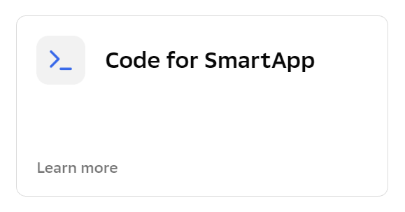

# salute-demo-app

Это небольшое Todo приложение (добавление, выполнение и удаление задач. [См. видео](https://youtu.be/P-o2rwHhARo)) демонстрирует пример взаимодействия с [Assistant Client](https://github.com/sberdevices/assistant-client). 

В данном репозитории находятся два приложения:
- приложение React, реализующее классическое демо-приложение To-do и использующее `assistan-client` для взаимодействия с бэкендом распознавания;
- архив `scenario-example.zip` - приложение Смарт-кода, выполняющееся на бэкенде распознавания речи и определяющее логику распознавания речи и голосового/текстового взаимодействия.
Обычного бэкенда, реализующего серверную логику и хранение данных, в этом приложении нет.

Для работы необходимо создать **два** проекта: один "SmartApp Code" (загрузив в него архив) и еще один - смартап в "SmartApp Studio", затем сгенерировать token и запустить приложение React.
                        

## Создание проекта "SmartApp Code":

1. Идём на страницу SmartMarket Studio ([ссылка](https://developers.sber.ru/studio/));
1. В меню слева нажимаем "Создать проект";
1. Выбираем "Инструменты разработки приложений" -> раздел "Мини-приложения Салют" -> **Code for SmartApp** (есть еще "Code for SulteBot" - это немного другой тип приложений)

    1. Указываем "Название проекта";
    1. В "Выбор шаблона" указываем "Пустой проект";
    1. Нажимаем "Создать проект";
1. Переходим на страницу с проектами ([ссылка](https://smartapp-code.sberdevices.ru/));
1. Заходим в сам проект, переходим в пункт меню "Настройки проекта" (внизу меню), потом на закладку "Экспорт/Импорт", нажимаем на "Прикрепите файл" ~~В меню проекта (кнопка "⋮") выбираем "Загрузить";~~
1. Выбираеv архив "scenario-example.zip" (лежит в корне этого проекта) -  не весь проект из Git, только zip-файл, который внутри этого проекта;
1. Нажимаем "Редактор" -> "Сценарии";
1. Нажимаем "Собрать";
1. Нажимаем "Публикации";
1. Нажимаем "Получить вебхук" (URL на Webhook в буфере обмена).
                              

## Создание проекта "SmartApp Canvas":

1. Идём на страницу SmartApp Studio ([ссылка](https://developers.sber.ru/studio/);
1. В меню слева нажимаем "Создать проект";
1. Выбираем "Инструменты разработки приложений" -> **SmartApp**
1. Указываем "Название смартапа" (указываем это же название в файле ".env.sample", в строке "REACT_APP_SMARTAPP"),  переименовываем его в ".env";
1. Переключаем "Выбор типа смартапа" на "Canvas App";
1. Нажимаем "Создать смартап".
1. ~~Либо~~ выбираем SmartApp Code API  и указываем URL на "Webhook" (полученный в "SmartApp Code")~~, либо выбираем SmartApp Code App и выбираем название и версию (в последующем версии нужно будет менять)~~;
1. Указываем URL на "Frontend Endpoint" (url страницы, где будет размещаться клиентская часть вашего приложения. **Для локального запуска не используется, можете указать любой)**;


## Генерация token:

1. Идём на страницу SmartApp Studio ([ссылка](https://developers.sber.ru/studio/) ~~[старая ссылка](https://smartapp-studio.sberdevices.ru/)~~);
1. В меню пользователя (правый верхний угол) выбираем "Настройки профиля";
1. Нажимаем "Эмулятор"~~"Auth Token"~~;
1. Нажимаем "Обновить ключ";
1. Нажимаем "Скопировать ключ" (сейчас token в буфере);
1. Указываем токен в файле ".env.sample", в строке "REACT_APP_TOKEN".
1. Переименовываем файл ".env.sample" в ".env".
               

## Запуск проекта:
              
~~Текущая версия приложения не работает под Nodejs 18. Протестировано под Nodejs 16.16.0.~~
Протестировано под Nodejs 18.15.0.

Установить нужную версию Nodejs можно либо непосредственно с сайта, либо (рекомендуется) с помощью утилиты `nvm`, позволяющей быстро переключаться между версиями Node из командной строки (`nvm install 16.16.0`, `nvm use 16.16.0`).
                               

Установка зависимостей проекта и запуск:

```bash
npm install -g yarn

yarn install

yarn run start
```

Должен открыться веб-браузер со страницей приложения, в котором (кроме обычного визуального интерфейса) в нижней части появится панель Ассистента с шариком слева. Кликом на шарике можно включать/отключать распознавание речи. При отключенном распознавании текст можно вводить с клавиатуры в строке справа от шарика.
                             

При вращающемся шарике в этом приложении доступны голосовые команды "Добавь "тест", "Выполнил "тест", "Удали "тест". 

Не забудьте разрешить доступ страницы к микрофону.
