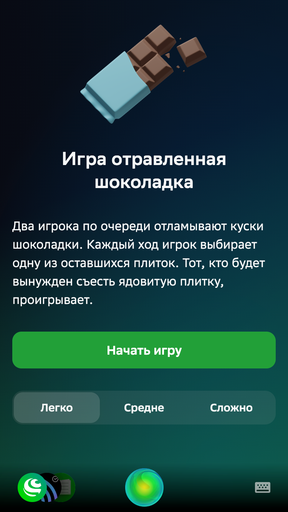

# chomp-sber

Это небольшой смартапп для ассистента Салют, реализующий игру [chomp](https://en.wikipedia.org/wiki/Chomp) / ["Щёлк"](https://ru.wikipedia.org/wiki/%D0%A9%D1%91%D0%BB%D0%BA),
переведённую здесь как "отравленная шоколадка". 

В данном репозитории находятся единственное приложение на React, реализующее интерфейс игры и использующее
`assistant-client` для взаимодействия с Салютом (для адаптации темы приложения в зависимости от персонажа).

Логики речевого взаимодействия, а также обычного бэкенда, реализующего серверную логику и хранение данных,
в этом приложении нет.

Для работы необходимо создать только смартапп в "SmartApp Studio", затем сгенерировать token и запустить приложение React.
Перед этим переименуйте файл ".env.sample" в ".env".

## Создание проекта "SmartApp Canvas":

1. Идём на страницу SmartApp Studio ([ссылка](https://developers.sber.ru/studio/));
2. В меню слева нажимаем "Создать проект";
3. Выбираем "Мини-приложения Салют" -> **CanvasApp**
4. Указываем "Название проекта" (указываем это же название в файле ".env", в строке "REACT_APP_SMARTAPP");
5. Нажимаем "Создать проект".

## Генерация token:

1. Идём на страницу SmartApp Studio ([ссылка](https://developers.sber.ru/studio/));
2. В меню управления пространством (правый верхний угол) выбираем "Настройки";
3. Нажимаем "Эмулятор";
4. Нажимаем "Обновить ключ";
5. Нажимаем "Скопировать ключ" (сейчас token в буфере);
6. Указываем токен в файле ".env", в строке "REACT_APP_TOKEN".
               

## Запуск проекта:

~~Текущая версия приложения не работает под Nodejs 18. Протестировано под Nodejs 16.16.0.~~
Протестировано под Nodejs 18.15.0.

Установить нужную версию Nodejs можно либо непосредственно с сайта, либо (рекомендуется) с помощью утилиты `nvm`,
позволяющей быстро переключаться между версиями Node из командной строки (`nvm install 16.16.0`, `nvm use 16.16.0`).

Установка зависимостей проекта и запуск:

```bash
npm install -g yarn

yarn install

yarn run start
```

Должен открыться веб-браузер со страницей приложения, в котором (кроме обычного визуального интерфейса)
в нижней части появится панель Ассистента с шариком. Кликом на шарике можно включать/отключать распознавание речи.
При отключенном распознавании текст можно вводить с клавиатуры в строке справа от шарика (выглядит чуть по-разному в
зависимости от соотношения сторон экрана).



Не забудьте разрешить доступ страницы к микрофону.

## Релиз

1. Соберите статический продакшн-архив командой `npm run build`;
2. Сожмите содержимое папки build в архив .zip (внимательно: нужно, чтобы в корне архива был файл index.html, а не папка
  build, внутри которой уже всё остальное. В MacOS, например, нужно выделить именно содержимое папки и выбрать сжатие);
3. Загрузите полученный архив в разделе "Хостинг фронтенда" в параметрах смартаппа.

## Известные проблемы и советы разработчикам смартаппов

Этот смартапп оптимизирован под вертикальный экран, на маленьких горизонтальных экранах вёрстка ломается.

В процессе разработки я пару раз переписывал почти с нуля приложение и много собачился с библиотеками Сбера. Пара советов:
- запускайте всё исключительно в хромиумах, иначе всё может сломаться в неожиданных местах;
- если идёт ошибка подключения к серверу Сбера, обновите версию salutejs-client, они могли поменять адрес эндпоинта;
- если всё ещё ошибка, возможно проблемы с государственными сертификатами, как у всего Сбера. Установите их или Яндекс.Браузер;
- подберите один раз версии реакта, salutejs-client и всех остальных зависимостей, с которыми всё запускается, и больше не трогйате;
- пишите сразу и всё на [Plasma](https://plasma.sberdevices.ru/ui/), если нет цели сделать что-то универсальное, 
  там из коробки и подстройка под персонажей;
- внимательно смотрите, что именно присылает в командах ассистент (дока на [гитхабе](https://github.com/salute-developers/salutejs-client)),
  это может не соответствовать типу TypeScript присылаемых данных в библиотеке. Пример -
  [CharacterCommand](https://github.com/salute-developers/salutejs-client#AssistantCharacterCommand), в типе зашито
  и имя, и пол, и обращение персонажа, а ассистент присылает только id на самом деле;
- забейте ОГРОМНЫЙ болт на [InsetsCommand](https://github.com/salute-developers/salutejs-client#AssistantInsetsCommand).
  Они просто сломаны, в [чате](https://t.me/smartmarket_community) об этом орали ещё в 2021, с тех пор ничего не поменялось.
  Приходят просто огромные, не соответствующие действительности bottom-инсеты, и как их не дели на всякие deviceScale и
  pixelsDensity, ничего хорошего не получится. Похоже, единственное нормальное решение - сделать константный отступ 144px снизу.
